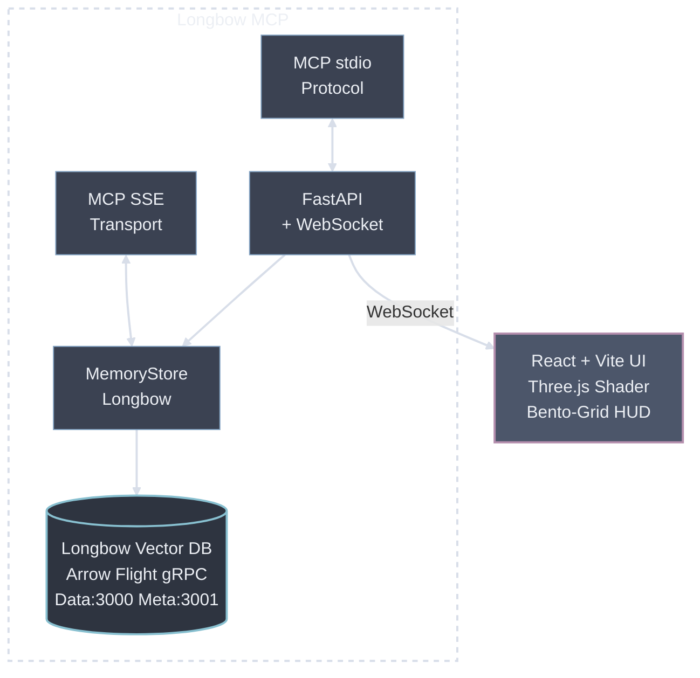

# Longbow MCP

A modern MCP (Model Context Protocol) server with real-time UI for cross-client persistent memory, powered by the Longbow distributed vector database.

## Features

- **MCP Protocol**: Full MCP implementation with stdio and SSE transports
- **Vector Search**: Semantic memory search using Longbow (Apache Arrow Flight) + sentence-transformers
- **Real-time UI**: WebSocket bridge with Three.js raymarching shader background
- **Design System**: Midnight Emerald - Obsidian, Emerald, Cyber-Lime glassmorphism
- **One-Command Deploy**: `docker compose up -d` starts everything

## Architecture

## Quick Start

```bash
# Clone the repository
git clone https://github.com/TerminallyLazy/longbow-mcp.git
cd longbow-mcp

# Run everything with Docker Compose
docker compose up -d
```

## Services

| Service | URL | Description |
|---------|-----|-------------|
| Longbow Data | grpc://localhost:3000 | Arrow Flight vector storage |
| Longbow Meta | grpc://localhost:3001 | Arrow Flight metadata |
| API Server | http://localhost:8000 | FastAPI + WebSocket endpoints |
| API Docs | http://localhost:8000/docs | OpenAPI/Swagger UI |
| MCP SSE | http://localhost:8765 | SSE transport for MCP clients |
| Web UI | http://localhost:3080 | React + Three.js interface |
| WebSocket | ws://localhost:3080/ws | Real-time memory updates (via nginx) |

## MCP Tools

The server provides these MCP tools via both stdio and SSE transports:

- `add_memory` - Store new memory with semantic embedding
- `search_memories` - Semantic search using vector similarity
- `list_memories` - List all memories with pagination
- `delete_all_memories` - Clear memory store

## MCP Client Configuration

### Claude Code (stdio)

Add to your project's `.mcp.json`:

```json
{
  "mcpServers": {
    "longbow-mcp": {
      "command": "python",
      "args": ["server/mcp_server.py"],
      "cwd": "/path/to/longbow-mcp"
    }
  }
}
```

### Agent Zero / SSE Clients

Use the SSE endpoint:

```
http://localhost:8765/sse
```

### Claude Desktop

Add to `~/Library/Application Support/Claude/claude_desktop_config.json`:

```json
{
  "mcpServers": {
    "longbow-mcp": {
      "command": "bash",
      "args": ["/path/to/longbow-mcp/run_mcp_server.sh"]
    }
  }
}
```

## UI Components

- **ThreeBackground.tsx** - Raymarching shader (reactive to memory count)
- **MemoryHUD.tsx** - Main bento-grid dashboard
- **MemoryCard.tsx** - Individual memory with glow effects
- **SearchPanel.tsx** - Semantic search interface
- **AddMemoryForm.tsx** - Memory creation with metadata
- **useMemoryBridge.ts** - WebSocket hook for real-time updates

## Design System

**Midnight Emerald Theme:**
- Background: #050505 (Obsidian)
- Primary: #5EF7A6 (Emerald)
- Accent: #FFFF21 (Cyber-Lime)
- Typography: Space Grotesk
- Style: Glassmorphism, bento-grid, neon glows

## File Structure

```
longbow-mcp/
├── docker-compose.yml         # Services orchestration
├── run_mcp_server.sh          # MCP stdio runner
├── run_mcp_sse.sh             # MCP SSE runner
├── setup.sh                   # Local dev setup
├── server/
│   ├── Dockerfile.server      # Python container
│   ├── requirements.txt       # Dependencies
│   ├── models.py             # Pydantic models
│   ├── memory_store.py       # Longbow vector storage
│   ├── mcp_server.py         # MCP stdio protocol
│   ├── mcp_server_sse.py     # MCP SSE protocol
│   └── api.py                # FastAPI + WebSocket
└── ui/
    ├── Dockerfile.ui          # Node container
    ├── nginx.conf            # Reverse proxy
    ├── package.json          # Dependencies
    ├── tailwind.config.js    # Design system
    ├── vite.config.ts        # Build config
    └── src/
        ├── main.tsx          # Entry point
        ├── App.tsx           # Main app
        ├── hooks/
        │   └── useMemoryBridge.ts
        ├── components/
        │   ├── ThreeBackground.tsx
        │   ├── MemoryHUD.tsx
        │   ├── MemoryCard.tsx
        │   ├── SearchPanel.tsx
        │   └── AddMemoryForm.tsx
        └── styles/
            └── index.css
```

## Manual Start (without Docker)

```bash
# Terminal 1: Start Longbow (requires Longbow installed)
longbow serve

# Terminal 2: Start API server
cd server
pip install -r requirements.txt
uvicorn api:app --host 0.0.0.0 --port 8000

# Terminal 3: Start MCP SSE server
cd server
python mcp_server_sse.py

# Terminal 4: Start UI dev server
cd ui
npm install
npm run dev
```

## API Endpoints

### Health Check
```bash
curl http://localhost:8000/health
```

### List Memories
```bash
curl http://localhost:8000/memories
```

### Search Memories
```bash
curl -X POST http://localhost:8000/search \
  -H "Content-Type: application/json" \
  -d '{"query": "machine learning", "top_k": 5}'
```

### Add Memory
```bash
curl -X POST http://localhost:8000/memories \
  -H "Content-Type: application/json" \
  -d '{
    "content": "TensorFlow is a machine learning framework",
    "metadata": {"category": "ai"}
  }'
```

### Delete All
```bash
curl -X DELETE http://localhost:8000/memories
```

## Technology Stack

**Backend:**
- Python 3.11
- FastAPI
- Longbow (Apache Arrow Flight gRPC)
- sentence-transformers (all-MiniLM-L6-v2)
- MCP SDK (stdio + SSE transports)
- Starlette (SSE server)
- WebSocket

**Frontend:**
- React 18
- TypeScript
- Vite 5
- Three.js (raymarching)
- Tailwind CSS
- Lucide icons

**Infrastructure:**
- Docker
- Docker Compose
- Nginx

## License

MIT
